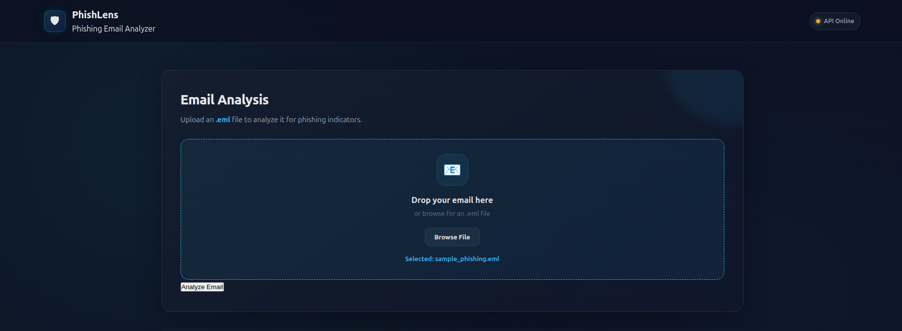
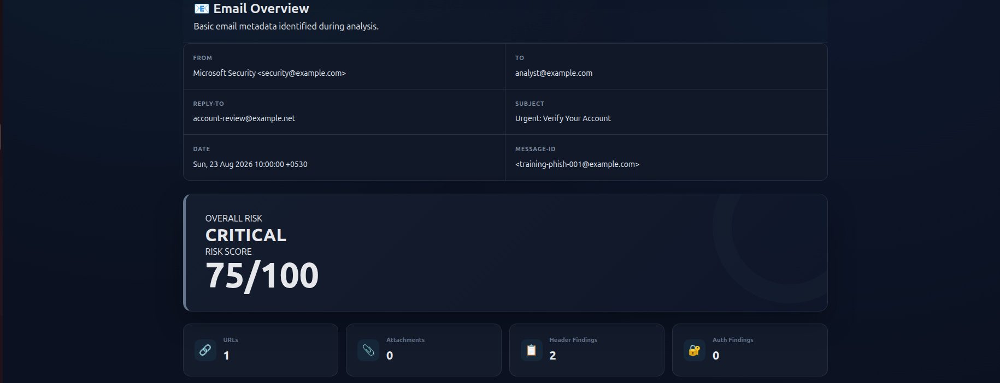
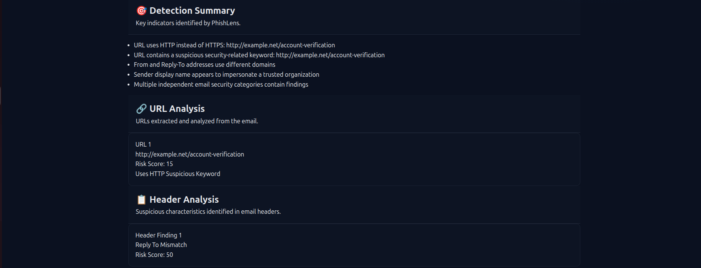
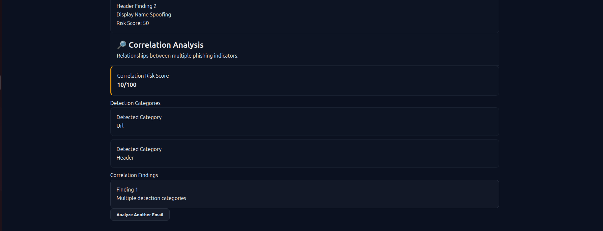
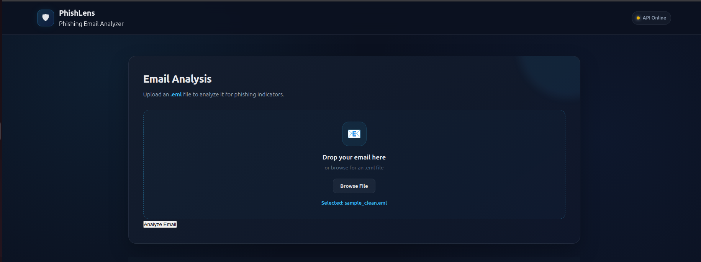
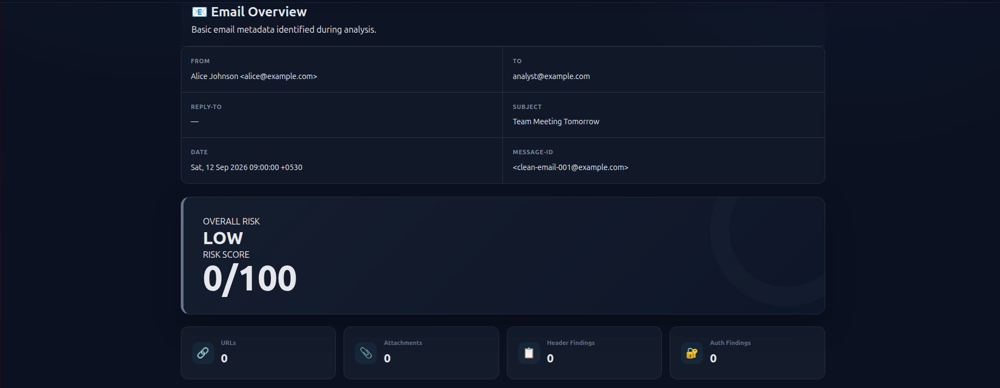
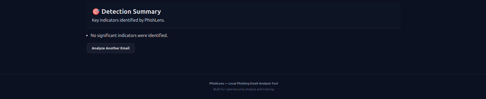

# 🛡️ PhishLens

## Phishing Email Analyzer

PhishLens is a local-machine phishing email analysis platform designed to help security analysts identify suspicious characteristics in `.eml` email files.

It analyzes email metadata, headers, URLs, attachments, and authentication results, then combines the findings into an overall risk score and correlation analysis.

> **Project type:** Cybersecurity / SOC / Detection Engineering
> **Input:** `.eml` email files
> **Deployment:** Local machine / training lab
> **Backend:** Python + FastAPI
> **Frontend:** HTML + CSS + JavaScript
> **Testing:** pytest

---

## 📌 Project Overview

Phishing emails commonly use multiple techniques at the same time, such as:

- Suspicious URLs
- HTTP links
- IP addresses instead of domains
- Redirect parameters
- URL obfuscation
- Suspicious keywords
- Link/visible-text mismatches
- Malicious or suspicious attachments
- Dangerous file extensions
- Double extensions
- MIME anomalies
- Reply-To mismatches
- Display-name spoofing
- SPF failures
- DKIM failures
- DMARC failures
- Multiple independent indicators

PhishLens analyzes these characteristics and presents the results through a web dashboard.

The project was built as a practical cybersecurity portfolio project to demonstrate phishing analysis, detection engineering, email security, Python development, API development, automated testing, and SOC-oriented investigation workflows.

---

# 🎯 Objectives

1. Parse `.eml` files safely.
2. Normalize important email information.
3. Extract URLs from plain-text and HTML email content.
4. Analyze URLs for suspicious characteristics.
5. Analyze email attachments without executing them.
6. Analyze suspicious email headers.
7. Analyze SPF, DKIM, and DMARC results when available.
8. Correlate findings from multiple detection categories.
9. Calculate an overall risk score.
10. Present results through an analyst-friendly dashboard.
11. Provide automated tests for detection components.
12. Demonstrate a practical SOC/phishing investigation workflow.

---

# 🏗️ Architecture

```text
                    ┌─────────────────────┐
                    │     User / Analyst  │
                    └──────────┬──────────┘
                               │
                               │ Upload .eml
                               ▼
                    ┌─────────────────────┐
                    │   PhishLens Web UI  │
                    │ HTML/CSS/JavaScript │
                    └──────────┬──────────┘
                               │
                               │ HTTP POST
                               ▼
                    ┌─────────────────────┐
                    │    FastAPI API      │
                    │    /analyze         │
                    └──────────┬──────────┘
                               │
                               ▼
                    ┌─────────────────────┐
                    │    Email Parser     │
                    └──────────┬──────────┘
                               │
                ┌──────────────┼──────────────┐
                │              │              │
                ▼              ▼              ▼
          URL Analysis   Attachment       Header
                          Analysis        Analysis
                │              │              │
                └──────────────┼──────────────┘
                               │
                               ▼
                    ┌─────────────────────┐
                    │ Authentication      │
                    │ SPF/DKIM/DMARC      │
                    └──────────┬──────────┘
                               │
                               ▼
                    ┌─────────────────────┐
                    │ Correlation Engine  │
                    └──────────┬──────────┘
                               │
                               ▼
                    ┌─────────────────────┐
                    │ Detection / Risk    │
                    │ Scoring Engine       │
                    └──────────┬──────────┘
                               │
                               ▼
                    ┌─────────────────────┐
                    │ Results Dashboard   │
                    └─────────────────────┘
```

---

# 🔄 Analysis Workflow

```text
Upload email
     ↓
Parse email
     ↓
Normalize email metadata
     ↓
Extract URLs
     ↓
Analyze URLs
     ↓
Analyze attachments
     ↓
Analyze headers
     ↓
Analyze authentication
     ↓
Correlate findings
     ↓
Calculate overall score
     ↓
Assign risk level
     ↓
Generate summary
     ↓
Display results
```

---

# 📂 Project Structure

```text
Phishlens/
├── README.md
├── .gitignore
├── backend/
│   ├── app/
│   │   ├── analyzers/
│   │   │   ├── attachment_analyzer.py
│   │   │   ├── authentication_analyzer.py
│   │   │   ├── detection_engine.py
│   │   │   ├── email_correlator.py
│   │   │   ├── header_analyzer.py
│   │   │   ├── link_analyzer.py
│   │   │   ├── url_analyzer.py
│   │   │   └── url_extractor.py
│   │   ├── engine/
│   │   │   └── detection_engine.py
│   │   ├── models/
│   │   │   ├── email_model.py
│   │   │   └── url_model.py
│   │   ├── parsers/
│   │   │   ├── email_normalizer.py
│   │   │   └── email_parser.py
│   │   └── api.py
│   └── test_*.py
├── frontend/
│   ├── index.html
│   ├── script.js
│   └── style.css
├── samples/
│   ├── sample_attachments.eml
│   ├── sample_authentication.eml
│   ├── sample_clean.eml
│   ├── sample_link_mismatch.eml
│   ├── sample_multipart.eml
│   ├── sample_phishing.eml
│   ├── sample_received.eml
│   ├── sample_urls.eml
│   └── test_*.eml
└── docs/
    └── screenshots/
        ├── 01_phishing_overview.png
        ├── 02_phishing_detection_url.png
        ├── 03_phishing_header.png
        ├── 04_phishing_correlation.png
        ├── 05_clean_overview.png
        ├── 06_clean_detection.png
        └── 07_clean_final.png
```

---

# 🔎 Detection Capabilities

## Email Parsing and Normalization

PhishLens extracts and normalizes:

- From
- To
- Reply-To
- Return-Path
- Subject
- Date
- Message-ID
- Received headers
- MIME structure
- Plain-text content
- HTML content
- Attachments

The parser preserves important header information, including repeated headers such as `Received`.

---

# 🔗 URL Analysis

URLs are extracted from both plain-text and HTML content. Duplicate URLs are consolidated while preserving their detected sources.

Implemented indicators include:

- HTTP usage
- IP-address hostname
- Unusual port
- Deep subdomain
- Suspicious keywords
- Long URL
- Redirect parameters
- Many query parameters
- `@` symbol
- Percent-encoded characters

Examples:

```text
http://example.com/login
http://192.0.2.50/login
http://example.com:8080/login
https://login.microsoft.com.security-check.example.net/account
https://example.com@evil.example.net/login
https://example.com/%6c%6f%67%69%6e
```

---

# 🔗 Link / Visible Text Mismatch

Phishing emails may display a trusted-looking link while pointing to another destination.

Example:

```text
Visible text:
Verify Microsoft Account

Actual destination:
http://evil.example.net/login
```

PhishLens analyzes HTML links and compares visible text with the actual destination.

---

# 📎 Attachment Analysis

Attachments are analyzed without executing them.

The analyzer extracts:

- Filename
- MIME type
- File size
- SHA-256 hash
- Indicators
- Risk score
- Risk level

Implemented checks include:

- Dangerous extension
- Suspicious filename
- Double extension
- Dangerous MIME type

Example:

```text
Invoice.pdf.exe
```

can trigger:

```text
dangerous_extension
double_extension
suspicious_filename
```

---

# 🔐 SHA-256 Hashing

PhishLens calculates SHA-256 hashes for attachments.

Hashing provides a stable identifier for a file and can later support threat-intelligence or malware-reputation integrations.

Attachments are not executed during analysis.

---

# 📋 Header Analysis

Header analysis checks:

- Missing From
- Missing To
- Missing Date
- Missing Message-ID
- Reply-To mismatch
- Display-name spoofing

Example:

```text
From:
security@example.com

Reply-To:
account-review@example.net
```

A mismatch can be suspicious when the sender appears to represent a trusted organization.

---

# 🔐 Authentication Analysis

PhishLens analyzes authentication-related information present in email headers.

Supported mechanisms include:

- SPF
- DKIM
- DMARC
- Authentication-Results

Example indicators:

```text
spf_fail
dkim_fail
dmarc_fail
```

Authentication findings become more meaningful when combined with other phishing indicators.

---

# 🔎 Correlation Analysis

Correlation is separate from the overall risk score.

The **overall risk score** represents the severity of detected indicators.

The **correlation score** represents supporting evidence created by relationships between multiple detection categories.

Example:

```text
URL finding
+
Header finding
=
Multiple detection categories
```

Another example:

```text
URL
+
Attachment
+
Header
=
Multi-layer phishing evidence
```

Possible detection categories include:

```text
url
attachment
header
authentication
```

---

# 📊 Risk Scoring

PhishLens calculates scores for individual detection categories and an overall email score.

Example:

```text
URL Risk Score:       15
Header Risk Score:    50
Authentication:        0
Correlation:           10

Overall Score:        75
Overall Risk:      CRITICAL
```

The correlation score is not a replacement for the overall risk score. It represents additional evidence from relationships between detection categories.

The displayed overall score is capped at 100.

Risk levels include:

```text
LOW
MEDIUM
HIGH
CRITICAL
```

---

# 🌐 API

PhishLens uses FastAPI.

Main endpoint:

```text
POST /analyze
```

Example:

```bash
curl -X POST   -F "file=@../samples/sample_phishing.eml"   http://127.0.0.1:8000/analyze
```

The API returns structured JSON containing:

- Email metadata
- URL results
- Attachment results
- Header results
- Authentication results
- Correlation results
- Overall score
- Overall risk
- Summary findings

---

# 🖥️ Frontend

The dashboard provides:

- `.eml` file selection
- Drag-and-drop upload
- API status indicator
- Email overview
- Overall risk
- Risk score
- URL statistics
- Attachment statistics
- Header findings
- Authentication findings
- Detection summary
- URL analysis
- Attachment analysis
- Header analysis
- Correlation analysis
- Analyze Another Email

---

# 🧪 Testing

The final backend test run produced:

```text
53 passed in 0.08s
```

Testing covers:

- Attachment analyzer
- Authentication analyzer
- Detection engine
- Email correlator
- Header analyzer
- URL analyzer
- Parser
- Normalizer
- URL extractor
- Link analysis
- Detection scenarios

Additional validation included clean, phishing, URL, attachment, authentication, multipart, and edge-case email samples.

JavaScript syntax was also validated successfully with Node.js.

---

# 🧰 Sample Emails

| Sample | Purpose |
|---|---|
| `sample_clean.eml` | Clean baseline |
| `sample_phishing.eml` | Combined phishing indicators |
| `sample_authentication.eml` | SPF/DKIM/DMARC failures |
| `sample_urls.eml` | Multiple URL indicators |
| `sample_link_mismatch.eml` | Link/visible-text analysis |
| `sample_multipart.eml` | Multipart + URL + attachment |
| `sample_attachments.eml` | Multiple suspicious attachments |
| `test_minimal.eml` | Missing-header edge case |
| `test_mime_mismatch.eml` | MIME/extension scenario |
| `test_nested_multipart.eml` | Nested MIME testing |
| `test_no_filename_attachment.eml` | Attachment edge case |

---

# 🖼️ Screenshots

## Phishing Email Analysis

### Email Overview



### URL Detection



### Header Analysis



### Correlation Analysis



## Clean Email Analysis

### Email Overview



### Detection Results



### Final Result



---

# ▶️ Installation

## Requirements

- Linux
- Python 3.10+
- pip
- Git
- Modern web browser

## Clone

```bash
git clone https://github.com/RUFSHANHARIF/PhishLens.git
cd Phishlens
```

## Virtual Environment

```bash
cd backend
python3 -m venv venv
source venv/bin/activate
```

## Dependencies

If `requirements.txt` is available:

```bash
pip install -r requirements.txt
```

---

# ▶️ Running PhishLens

Start the backend from `backend`:

```bash
source venv/bin/activate
uvicorn app.api:app --reload
```

The local API runs at:

```text
http://127.0.0.1:8000
```

Open:

```text
frontend/index.html
```

in a browser.

Then:

1. Select an `.eml` file.
2. Click **Analyze Email**.
3. Review the overall risk.
4. Review individual findings.
5. Review correlation results.

---

# 🔒 Security Design

PhishLens follows several defensive principles:

- Do not execute email attachments.
- Analyze attachment metadata instead of running files.
- Calculate hashes without executing files.
- Keep normal analysis local.
- Treat email content as untrusted input.
- Validate uploaded files.
- Separate parsing from detection logic.
- Return structured analysis results.

---

# ⚠️ Limitations

PhishLens is a portfolio/training project and does not replace enterprise email-security platforms.

Current limitations include:

- No live threat-intelligence integration
- No external URL reputation service
- No live malware sandbox
- No live DNS reputation system
- No production mail gateway integration
- No enterprise authentication system
- No persistent analysis database
- Limited behavioral analysis
- Primarily rule-based detection
- Authentication analysis depends on information present in the email

These limitations also provide opportunities for future development.

---

# 🚀 Future Improvements

Potential improvements include:

- Threat-intelligence API integration
- Domain reputation checking
- DNS-based SPF validation
- Live DKIM verification
- DMARC policy validation
- WHOIS information
- URL reputation services
- Malware hash reputation
- YARA-based attachment analysis
- Machine-learning classification
- Email campaign correlation
- Improved authentication analysis
- User authentication
- Analysis history
- Exportable investigation reports
- SOC/DFIR workflow integration
- SIEM integration
- Automated IOC extraction
- Analyst case management

---

# 🧠 Cybersecurity Skills Demonstrated

This project demonstrates practical experience with:

- Phishing analysis
- Email security
- Email header analysis
- Email authentication
- SPF / DKIM / DMARC
- URL analysis
- Link mismatch detection
- MIME analysis
- Attachment analysis
- SHA-256 hashing
- Risk scoring
- Detection engineering
- Security event correlation
- Python
- FastAPI
- REST APIs
- Automated testing
- Linux
- Git
- GitHub
- SOC analysis concepts

---

# 💼 Resume Description

### PhishLens — Phishing Email Analyzer

**Technologies:** Python, FastAPI, HTML, CSS, JavaScript, pytest, Linux, Git

Developed a local phishing email analysis platform that parses `.eml` files and detects suspicious URLs, attachments, email headers, display-name spoofing, Reply-To mismatches, and SPF/DKIM/DMARC authentication failures. Implemented rule-based risk scoring and multi-category correlation analysis, SHA-256 attachment hashing, MIME analysis, automated testing, and a web-based analyst dashboard.

---

# 🎤 Interview Talking Point

A concise project explanation:

> PhishLens is a local phishing email analyzer that accepts `.eml` files and performs layered security analysis. It parses and normalizes the email, extracts and analyzes URLs, examines attachments and headers, evaluates authentication results such as SPF, DKIM, and DMARC, and correlates findings across multiple categories. It then generates an overall risk score and presents the results through a web dashboard. I also created automated tests covering individual detection components and multiple email scenarios.

---

# 📈 Project Validation

Validation included:

```text
53 automated tests
53 passed
0 failed
```

Additional validation:

- Clean email testing
- Phishing email testing
- URL indicator testing
- Attachment testing
- Authentication testing
- Link mismatch testing
- Multipart email testing
- Edge-case testing
- Frontend testing
- JavaScript syntax validation
- Git repository validation

---

# 📌 Project Purpose

PhishLens was developed as a cybersecurity portfolio project to demonstrate practical understanding of:

- Phishing detection
- Email security
- Detection engineering
- Security automation
- SOC analyst workflows
- Python backend development
- REST API development
- Frontend security dashboards
- Automated testing

The project provides a foundation that can later be extended with external threat intelligence, reputation services, machine learning, sandboxing, SIEM integration, and enterprise workflows.

---

# 👤 Author

**RUFSHANHARIF**

Cybersecurity Project — **PhishLens**

---

## 📜 Disclaimer

PhishLens is intended for cybersecurity education, authorized security analysis, and portfolio demonstration.

Only analyze email samples and files that you are authorized to inspect.

